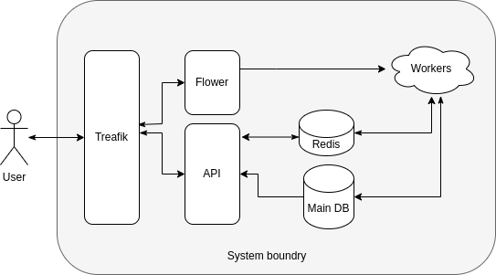

<div dir="rtl">

# کارگزاری آبان 

## معرفی 
کارگزاری آبان یک سامانه جهت تامین نقدینگی برای متقاضیان رمزارز <<آبان>> پیاده سازی شده است.

در این سامانه افراد پس از احراز هویت قادر هستند تا با ثبت سفارش خود اقدام به خرید ارز مورد نظر نمایند.


## قابلیت ها
- ثبت نام کاربر
- احراز هویت
- ثبت سفارش خرید


##  معماری پروژه
بطور کلی این پروژه در معماری لایه‌ای **MVT** پیاده سازی شده است.
اما برای افزایش قابلیت هایی همچون **نگهداری** آسان‌تر،
**انعطاف پذیری** بیشتر و **تست پذیری** بالاتر از الگوها و
تکنیک هایی مانند **ایزوله سازی بیزینس لاجیک** در لایه سرویس و ... استفاده شده.

همچنین برای بهبود و بهینه سازی عملکرد این سامانه پردازش های اصلی از چرخه Request/Response خارج شده و فعالیت های پردازشی بصورت افلاین و توسط ورکرهای توزیع شده انجام میشود.

در این پروژه از کتابخانه ها و ابزار های زیر استفاده شده:

#### 1. Django, DRF:

در این سامانه برای مدیریت فرایند ها از فریمورک جنگو استفاده است.
به این دلیل که این فریمورک از ویژگی های مفیدی همچون سرعت پیاده سازی بالا، مدیریت و حفظ یکپارچگی اطلاعات پایگاه داده،
تطبیق پذیری آسان با سایر تکنولوژی ها و پشتیبانی از مکانیزم های امنیتی برخوردار است.

همچنین میتوان به پیشتیبانی نکردن از توابع ناهمزمان (async) بصورت یکپارچه و آسان که تاثیر زیادی در بهینه سازی فعالیت های ورودی/خروجی (I/O) اشاره کرد. 


#### 2. Queue System (Redis): 
   - برای پردازش دستورات و صف‌بندی سفارش‌ها از Redis استفاده شده است.
   - اطلاعات سفارش‌ها پس از ارسال به API، در صف Redis ذخیره و توسط سرویس‌های جداگانه پردازش می‌شوند.

#### 3. Traefik:
   - این ابزار به عنوان Reverse Proxy و Load Balancer به کار گرفته شده است.
   - این ابزار درخواست‌های HTTP و HTTPS را مدیریت کرده و به سرویس‌های داخلی هدایت می‌کند.

#### 4. Database (PostgreSQL):
   - داده‌های پایدار مانند اطلاعات کاربران و سفارش‌ها در پایگاه داده PostgreSQL ذخیره می‌شوند.


### دیاگرام معماری




## نحوه نصب و اجرا

برای دریافت پروژه از دستور زیر استفاده کنید.

<div dir="ltr">

```bash
git clone https://github.com/GhasemiTaheri/aban-exchange.git
cd aban-exchange
```
</div>

برای اجرای تست از دستور زیر میتوانید استفاده کنید.

<div dir="ltr">

```bash
docker compose -f docker-compose.local.yml run --rm django pytest
```
</div>

برای راه اندازی پروژه در حالت توسعه تنها کافیست تا از نصب بودن داکر روی سیستم خود اطمینان حاصل کنید و سپس دستور زیر را در دایرکتوری پروژه اجرا کنید.
پیش از اجرای این دستور از مقدار دهی متغییر های محیطی در دایرکتوری .env اطمینان حاصل کنید.

<div dir="ltr">

```bash
docker compose -f docker-compose.local.yml up --build -d
docker compose -f docker-compose.local.yml exec -d django python manage.py init_periodic_tasks
```
</div>


## چالش ها و راه حل

### مدیریت تراکنش‌های مالی و صحت داده‌ها
**شرح**: در هنگام ذخیره‌سازی اطلاعات تراکنش‌ها، خطر ایجاد ناسازگاری بین مانده حساب کاربران و سفارش‌های ثبت‌شده وجود داشت.

**راه‌حل**: استفاده از مکانیزم Transaction Management در Django و قفل‌گذاری جداول بوسیله (select_for_update) برای اطمینان از صحت داده‌ها و جلوگیری از به‌روزرسانی همزمان.

### مقیاس‌ پذیری و مدیریت صف سفارشات
**شرح**: تعداد زیاد سفارشات می‌توانست به بار سنگینی روی پایگاه داده منجر شود.

**راه‌حل**: استفاده از Redis به عنوان صف برای ذخیره و مدیریت سفارش‌ها و پردازش آن‌ها در دسته‌های مشخص.


## بهبود های آنیده

#### بهبود قابلیت مقیاس‌پذیری سرویس
اضافه کردن Load Balancer برای توزیع درخواست‌ها بین چند سرور و بهینه‌سازی عملکرد در زمان ترافیک بالا.

#### گسترش گزارش‌گیری و مانیتورینگ
پیاده‌سازی ابزارهایی مانند Prometheus و Grafana برای نظارت بر عملکرد سیستم و ثبت رویدادهای مهم.

#### پیاده‌سازی الگوریتم تطبیق سفارشات پیشرفته
بهبود الگوریتم‌های موجود برای کاهش تأخیر در پردازش سفارشات و استفاده از الگوریتم‌های تطبیق بهتر.

#### ارتقای امنیت سیستم
افزودن قابلیت Rate Limiting برای جلوگیری از حملات Brute Force.

#### افزودن تست‌های خودکار بیشتر
پوشش تست‌های End-to-End برای اطمینان از عملکرد کل سیستم در شرایط مختلف.

#### کاهش SPOF ها برای افزایش پایداری
استفاده از کلاستر Redis.

استفاده از Database Replica.

#### بهینه سازی celery
اولویت بندی تسک ها، بهینه سازی ورکر ها.

</div>


